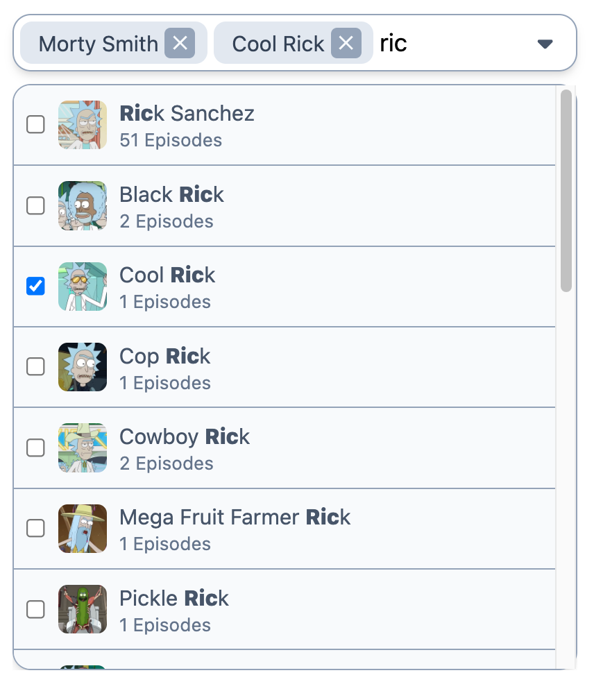

# React.js kullanarak multi-select autocomplete component implement

<details><summary><b>Case</b></summary>
<br/>
Adcreative.ai frontend developer pozisyonu icin hazirladigimiz bu case'de sizden React.js kullanarak multi-select autocomplete component implement etmenizi istiyoruz.
Daha sonra bu componenti "Rick and Morty" api'daki karakterleri aramak ve select etmek icin kullanacaksiniz.

Api linki: https://rickandmortyapi.com/documentation/#introduction


</details>

<details><summary><b>Verilen assetler:</b></summary>


 Ornek tasarım  

</details>

<details><summary><b>Gereksinimler</b></summary>

* React vs Typescript
* Tasarima uygun multi-select implementasyonu
* input alanina yazilan query ile api sorgulanip popup content'de listelenmesi
* Listelenen sonuclarda her bir karater icin karater resmi, ismi ve kac bolumde oynadigi bilgisinin gosterilmesi
* query icin yazilan sozcugun listelenen sonuclarda vurgulanmasi (ornek tasarimda 'ric' aramasi sonuclarinda 'Ric' bold seklinde gosterilmistir)
* secilen sonuclarin input alanina eklenmesi ve cikarilmasi
* Keyboard navigation desteklenmeli. Yon tuslari ve tab kullanarak tum islemler yapilabilmeli, input alanindaki secili ogeler veya sonuc listesindeki satirlar gezinebilmeli ve silme/secme islemleri yapilabilmeli.
* Loading state gosterimi
* Exception handling ve error statelerinin arayuzde gosterilmesi
* Ve tabi ki yazdiginiz kodun mimarisi, temiz ve okunakli olmasi belki de en onemli kriter olacaktir.
<br/>
 Ornek tasarım  <br/>  <br/> 
</details>

This is a [Next.js](https://nextjs.org/) project bootstrapped with [`create-next-app`](https://github.com/vercel/next.js/tree/canary/packages/create-next-app).

## Getting Started

First, run the development server:

```bash
npm run dev
# or
yarn dev
# or
pnpm dev
# or
bun dev
```

